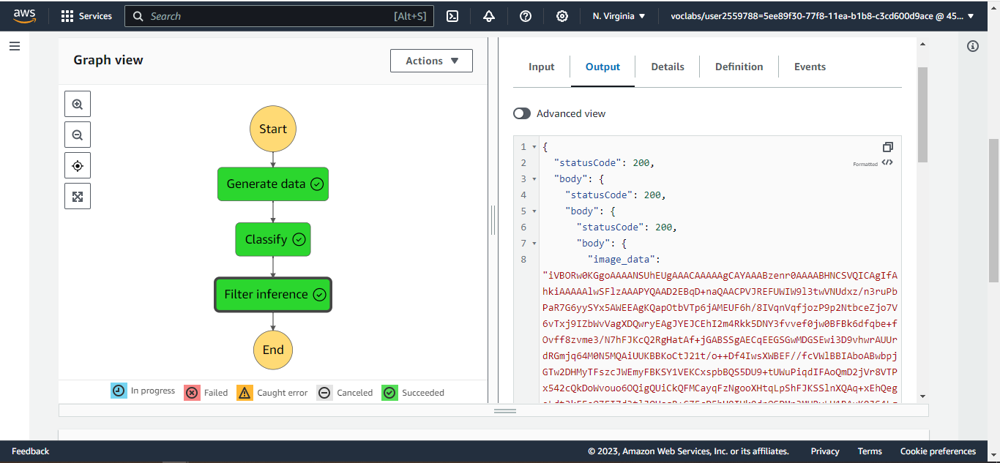

# Project Overview
In this project, we explored what it's like to be a ML engineer by designing and developing a ML workflow fro Scones unlimited and finally, deploying the solution on AWS to meet the business need.
Using AWS services like SageMaker, Step Functions, Lambda, S3, etc, I was able to achieve the needed objectives.

## Background
Image Classifiers are used in the field of computer vision to identify the content of an image and it is used across a broad variety of industries, from advanced technologies like autonomous vehicles and augmented reality, to eCommerce platforms, and even in diagnostic medicine.

You are hired as a Machine Learning Engineer for a scone-delivery-focused logistics company, Scones Unlimited, and you’re working to ship an Image Classification model. The image classification model can help the team in a variety of ways in their operating environment: detecting people and vehicles in video feeds from roadways, better support routing for their engagement on social media, detecting defects in their scones, and many more!

In this project, you'll be building an image classification model that can automatically detect which kind of vehicle delivery drivers have, in order to route them to the correct loading bay and orders. Assigning delivery professionals who have a bicycle to nearby orders and giving motorcyclists orders that are farther can help Scones Unlimited optimize their operations.

As an MLE, your goal is to ship a scalable and safe model. Once your model becomes available to other teams on-demand, it’s important that your model can scale to meet demand, and that safeguards are in place to monitor and control for drift or degraded performance.

In this project, you’ll use AWS Sagemaker to build an image classification model that can tell bicycles apart from motorcycles. You'll deploy your model, use AWS Lambda functions to build supporting services, and AWS Step Functions to compose your model and services into an event-driven application. At the end of this project, you will have created a portfolio-ready demo that showcases your ability to build and compose scalable, ML-enabled, AWS applications.

## Project Files
The files include:
* starter.ipynb: is the main notebook which contains all the code necessary from the data preprocessing to the model traing and deplyment.
* lambda.py: This file contain the codes of the lambda functions used. 3 different lambda functions where used, hence there are 3 different functions for each of them in this file.
* StepFunction.json: This file contain the AWS Step function json.

### Here an image of the working Step Function:

